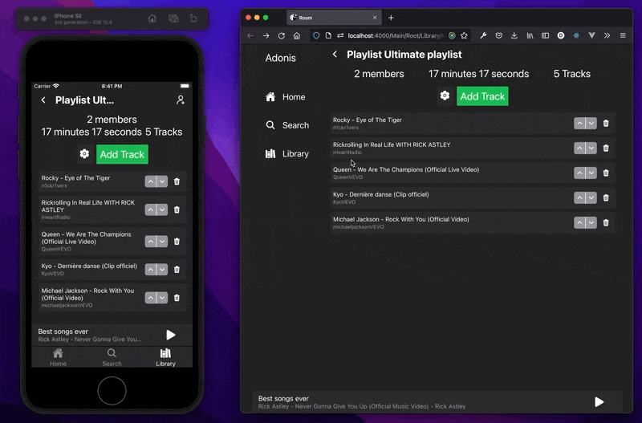
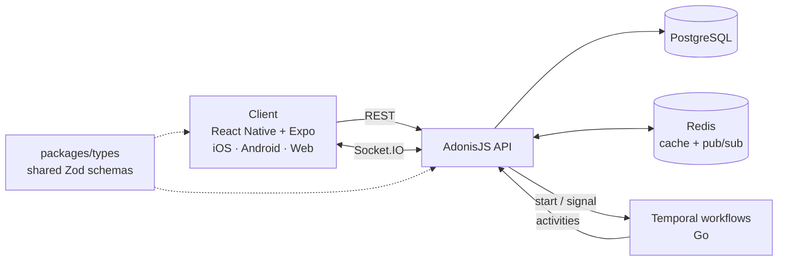

# MusicRoom

Cross-platform iOS, Android and web app for listening to music together in real time: rooms where everyone suggests and votes on the next track, and playlists edited live by several people at once.

**Stack:** TypeScript monorepo · React Native (Expo) · XState · React Query · AdonisJS · PostgreSQL · Redis · Socket.IO · Temporal (Go) · Zod · Playwright

## Architecture

- **Long-lived room state lives in Temporal workflows**, so a room keeps its queue, votes and playback state across restarts and is updated by signals from the API.
- **Client logic is modelled as XState state machines**, which are also used for model-based tests (`@xstate/test`).
- **One Zod schema package** validates payloads on both the client and the server.
- **Redis pub/sub behind Socket.IO** lets several API instances broadcast the same room events. Artillery load tests live in `packages/stress`.

See [technical stack](docs/technical-stack.md) and [setup](docs/setup.md) for details.

## Features

### Music Track Vote (MTV)

A collaborative music listening session where users suggest and vote for tracks to be played.

- **Constraints** — the creator can restrict participation by location and time window
- **Emission modes** — _broadcast_ (all users play sound) or _direct_ (a single designated user emits)
- **Device selection** — users choose which of their devices plays sound
- **Privacy** — rooms can be public or private (invite-only)
- **Permissions** — members can suggest tracks, vote, and control playback (play, pause, skip) depending on granted permissions
- **Social** — users can chat and follow each other inside a room

### Music Playlist Editor (MPE)

A real-time collaborative playlist editor.

- Users create or join MPE rooms to suggest, remove, and reorder tracks
- A user can be a member of multiple MPE rooms simultaneously, all listed in their Library
- Any MPE room can be exported into an MTV room, with the playlist as the initial track queue

## Packages

| Package | Description |
|---|---|
| `packages/client` | React Native (Expo) mobile and web app |
| `packages/server` | AdonisJS REST + WebSocket API |
| `packages/temporal` | Go-based Temporal workflows and activities |
| `packages/types` | Shared Zod schemas and TypeScript types |
| `packages/stress` | Artillery load tests |

## Documentation

- [Technical stack](docs/technical-stack.md)
- [Setup guide](docs/setup.md)
